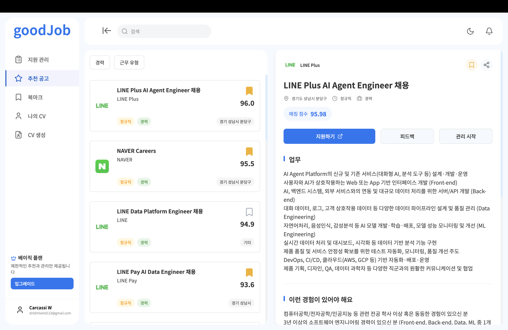
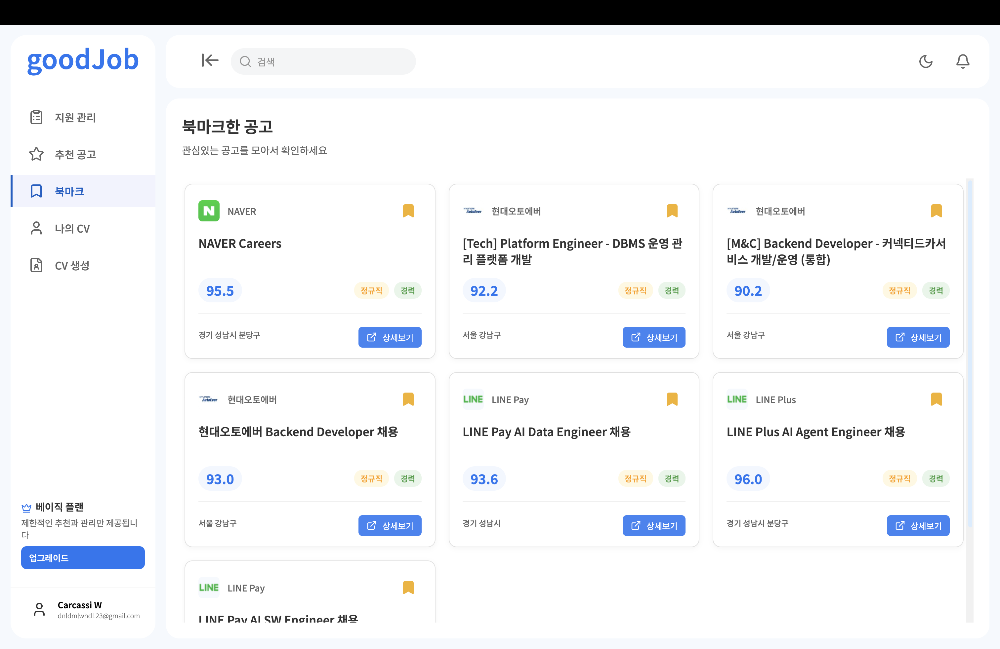
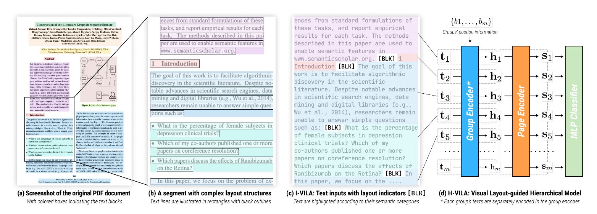
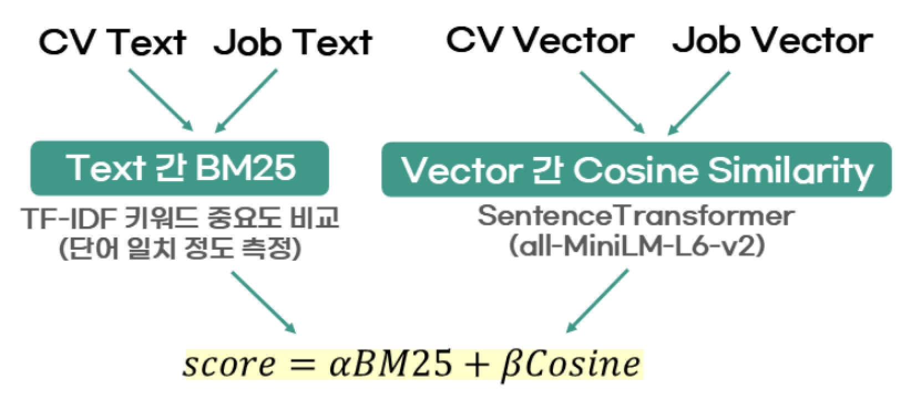
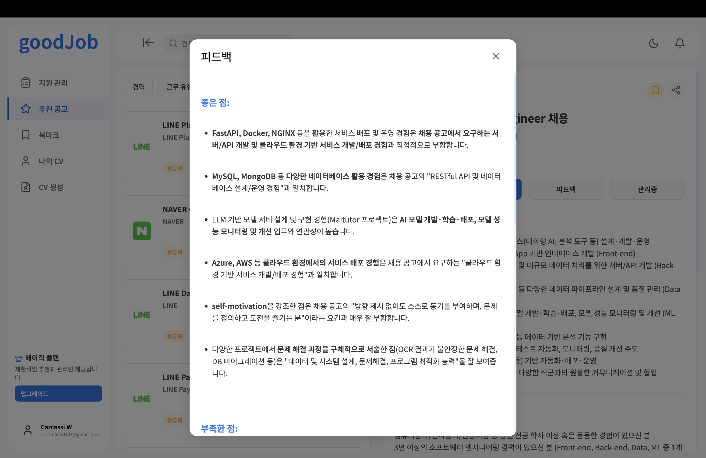
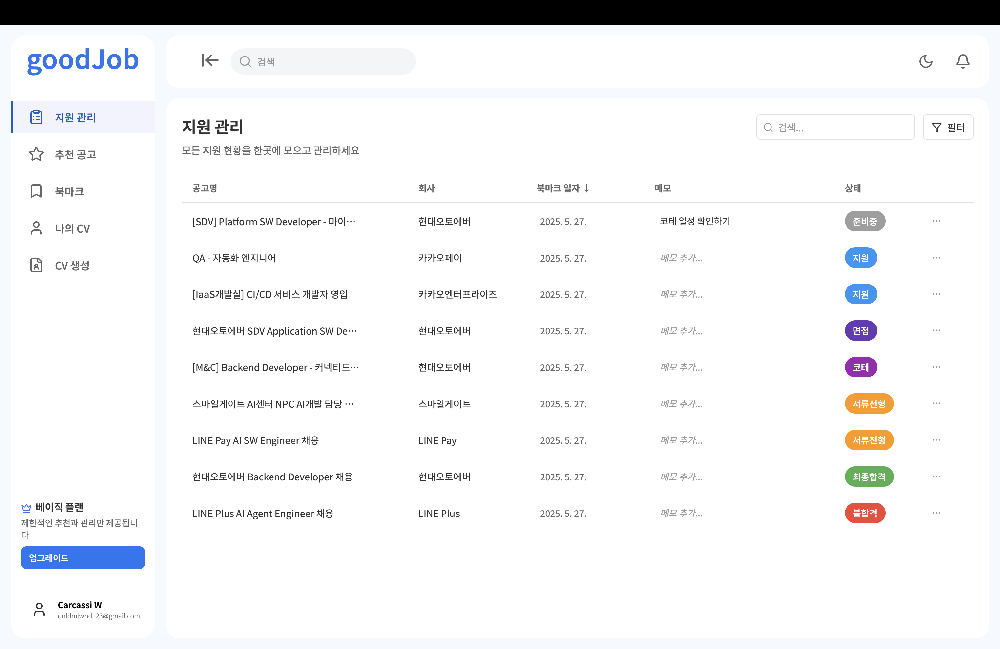
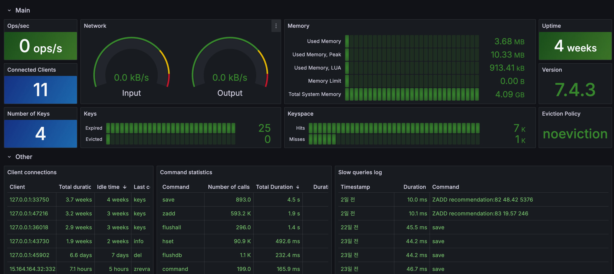
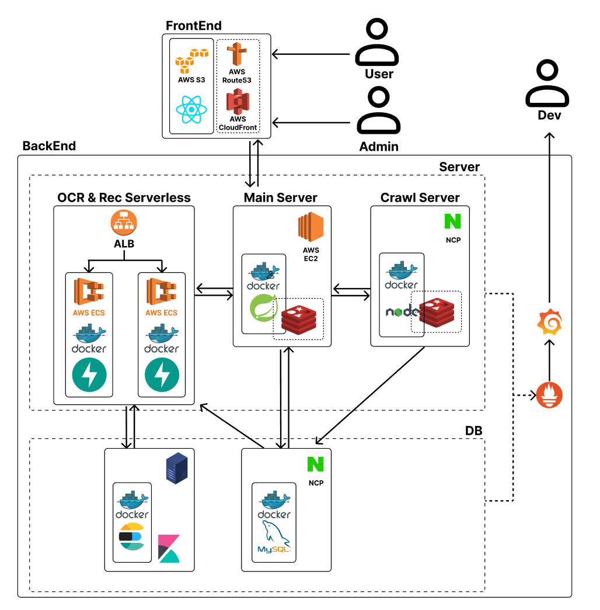
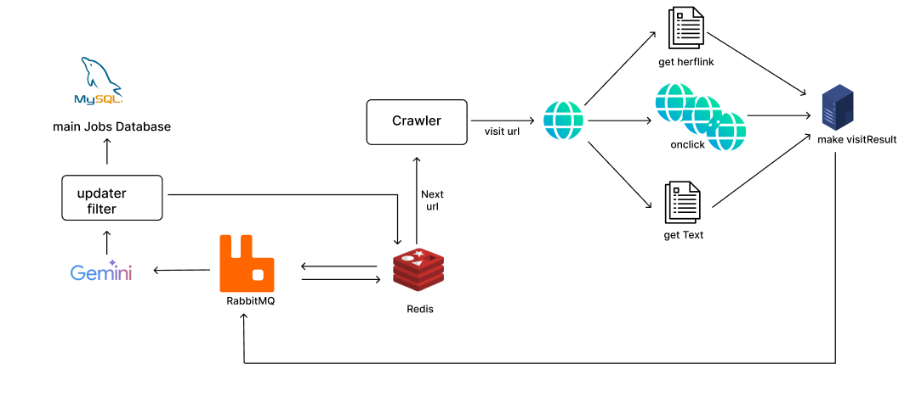
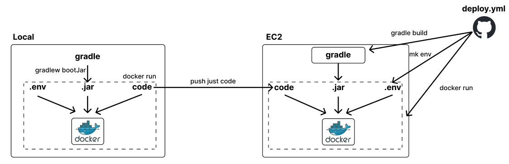

# <a href="https://www.goodjob.ai.kr" target="_blank">goodJob</a>: CV 기반 채용공고 추천 플랫폼


## Team Member

<table>
<thead>
<tr>
<th>Name</th>
<th>Part</th>
<th>What I do</th>
<th>branch</th>
</tr>
</thead>
<tfoot>
<tbody>
<tr>
<td><a href="https://github.com/hun9008" target="_blank">정용훈</a></td>
<td>BE AI</td>
<td>추천 시스템 및 OCR 파이프라인, 추천 관련 API 및 Redis 캐싱, DevOps</td>
<td>
  <a href="https://github.com/hun9008/CV_Search/tree/dev_spring">
    
  </a>
  <a href="https://github.com/hun9008/CV_Search/tree/dev_ES">
    
  </a>
</td>
</tr>
<tr>
      <td>
        <a href="https://github.com/21YuJin" target="_blank">유진</a>
      </td>
      <td>BE</td>
      <td>OAuth 회원가입, 지원이력, 피드백 생성, 공고 검색 및 필터 기능 구현</td>
      <td>
        <a href="https://github.com/hun9008/CV_Search/tree/dev_spring_jin">
          
        </a>
      </td>
</tr>
<tr>
<td><a href="https://github.com/sehyunsix" target="_blank">육세현</a></td>
<td>blk</td>
<td>blk</td>
<td>
  <a href="https://github.com/hun9008/CV_Search/tree/dev_crawl">
    
  </a>
</td>
</tr>
<tr>
<td>
<a href="https://github.com/Carcassi0" target="_blank">위의종</a>
</td>
<td>blk</td>
<td>blk</td>
<td>
  <a href="https://github.com/hun9008/CV_Search/tree/dev_front">
    
  </a>
</td>
</tr>
</tbody>
</table>

* 뱃지를 눌러 각 개발 브랜치로 이동할 수 있습니다.

# 프로젝트 개요

[](https://deepwiki.com/hun9008/CV_Search) [](https://www.goodjob.ai.kr)

<a href="https://www.goodjob.ai.kr" target="_blank">goodJob</a>은 구직자가 PDF 형식의 이력서(CV)를 업로드하기만 하면 </br>
이력서 내용을 분석하여 맞춤 채용 공고를 추천하고 </br>
지원 현황을 통합 관리할 수 있도록 돕는 통합 플랫폼입니다.

# 주요 기능 및 차별점




사용자가 업로드한 CV를 기반으로 크롤링된 채용 공고들과의 텍스트 및 </br>
임베딩 유사도 점수를 계산하여 가장 적합한 공고를 자동 추천하는 화면입니다.

- 좌측: 추천 공고 리스트 (유사도 점수 기반 정렬)
- 우측: 선택한 공고의 상세 정보, 매칭 점수, 피드백, 지원 기능 제공



관심 있는 채용 공고를 북마크하여 저장하고 </br>
한눈에 비교하거나 추후 지원을 관리할 수 있는 화면입니다.

-	카드형 UI로 공고들을 간결하게 정리
-	상세 보기 및 상태 확인이 용이

## 1. CV 형식 무관, 정밀 공고 추천





| 항목        | 설명 |
|-------------|------|
| **형식 자유도** | 어떤 형태의 PDF 이력서든 업로드만 하면 분석 가능 |
| **기술 기반** | <a href="https://github.com/allenai/vila" target="_blank">VILA</a> 기반 OCR (EfficientNet)로 문서 구조와 시각 블록 정밀 인식 |
| **추천 로직** | BM25 (TF-IDF 기반 키워드 유사도)<br>+ <a href="https://huggingface.co/sentence-transformers/all-MiniLM-L6-v2" target="_blank">SentenceTransformer</a> (Cosine Similarity) |
| **결과** | 자유 양식 이력서도 높은 정확도로 채용 공고 자동 추천 |


## 2. 구체적이고 실용적인 공고 피드백



| 항목        | 설명 |
|-------------|------|
| **분석 대상** | 채용 공고와 이력서를 항목 단위로 정렬·비교 |
| **분석 항목** | 부족한 역량 (기술 스택, 프로젝트 등)<br>강점 요소 (핵심 기술, 연차 등) |
| **피드백 방식** | 항목별로 정량적 피드백 제공 |
| **사용자 효과** | 목표 설정과 보완 전략 수립 가능<br>단순 추천을 넘어선 실질적 방향 제시 |

## 3. 통합된 이력 및 지원 현황 관리



| 항목        | 설명 |
|-------------|------|
| **기능** | 관심 공고 북마크<br>지원 이력 및 상태(지원 완료, 결과 대기 등) 통합 관리 |
| **효율성** | 공고 탐색부터 지원·결과 확인까지 한 플랫폼에서 연속적 흐름 제공 |
| **사용자 경험** | 분산된 구직 활동을 통합적으로 구성하여 관리 효율 극대화 |

## 4. 운영 확장성과 실시간 모니터링 지원



| 항목        | 설명 |
|-------------|------|
| **모니터링 도구** | Prometheus + Grafana 대시보드 |
| **지표 확인** | 서버 부하, 추천 응답 시간, 사용자 지표 등 실시간 시각화 |
| **안정성 확보** | RabbitMQ, Redis, ECS 기반으로 자동 확장 및 복원 가능 |
| **전체 흐름 관리** | 추천, OCR, 크롤링 등 모든 시스템 상태 통합 모니터링 |

# 시스템 아키텍처



## 아키텍처 설계 원칙

1. DB Isolation: 기능 단위 데이터베이스 분리
  사용자, 공고, 추천, 이력서 등 도메인별로 데이터베이스를 분리해 충돌을 방지하고
  모듈별 독립 배포와 스키마 변경 시 영향 최소화를 가능하게 했습니다.
  데이터 통합은 API 레벨에서 수행됩니다.

2. 확장성과 비동기 처리: 추천 연산은 FastAPI 서버에서 처리되며 ECS 기반 Auto Scaling을 통해 트래픽에 유연하게 대응합니다. RabbitMQ로 요청을 비동기 처리하고 Redis 캐싱으로 응답 속도와 안정성을 확보했습니다.

3. 모듈화와 책임 분리: 프론트엔드, 백엔드, 추천 서버, 모니터링, 데이터베이스는 모두 컨테이너 단위로 분리되어 구성되며 각 컴포넌트는 독립적으로 운영되어 유지보수와 장애 대응이 용이합니다.

- **Spring** 기반 메인 서버를 중심으로 통신 구조 통합 
- **FastAPI** 서버는 **ECS**에 배포되어 Auto Scaling 지원
- **Redis, RabbitMQ**를 통한 데이터 처리 안정성 확보 
- Docker 및 GitHub Actions로 **CI/CD 자동화** 
- **Prometheus + Grafana**로 로그 및 상태 실시간 모니터링 
- 프론트엔드는 **S3 + CloudFront + Route53**으로 정적 배포
- **Redis** 캐싱으로 추천 결과 응답 속도 <strong style="color:#FF5722;">약 60% 개선</strong>

# 공고 크롤링 파이프라인




- 1단계: URL 수집 및 큐 등록
  - Crawler는 초기 단계에서 약 5만 개 이상의 URL을 자동 수집합니다.
  - 수집된 URL의 접근 가능 여부(HTTP 상태 코드, 차단 여부 등)를 판단합니다.
  - 방문해야 할 URL 목록을 Redis에 저장하거나, RabbitMQ 큐에 푸시하여 비동기 작업을 준비합니다.

- 2단계: 페이지 방문 및 콘텐츠 수집
  - Headless 브라우저 기반의 Crawler가 URL을 방문하며 다음 작업을 수행합니다:
  - get href link: 페이지 내의 서브 링크 추출 
  - onclick: 자바스크립트 기반 동적 콘텐츠 트리거링
  - get Text: 실제 채용 공고 텍스트 정보 수집
  - 수집된 데이터는 visitResult 객체로 정리되어 다음 단계로 전달됩니다.

- 3단계: 공고 여부 판별 및 정제
  - 수집된 visitResult는 Gemini LLM에 전달되어 다음 작업을 수행합니다:
  - 채용 공고 여부 분류 (잡담/뉴스/회사소개 등은 제거)
  - 중요 정보 추출 및 구조화 (회사명, 포지션, 지역, 경력 조건, 요구 스택 등)
  - 결과는 필터링과 정제 과정을 거쳐 updater filter 모듈로 전달됩니다.

- 4단계: 최종 저장 및 검색 최적화
  - 정제된 공고 데이터는 MySQL 기반의 main Jobs Database에 저장됩니다.
  - 저장된 데이터는 이후 검색 엔진(예: Elasticsearch)이나 추천 시스템에서 활용 가능하도록 구성됩니다.

- 비동기 및 안정성 구성
  - RabbitMQ는 전체 과정의 중간 큐 역할을 하며, 작업 간 비동기 메시지 전달을 담당합니다.
  - Redis는 URL deduplication, 작업 상태 추적, 중간 결과 캐싱 등의 속도 최적화와 상태 관리에 사용됩니다.

# Tech Stack

**FrontEnd**

[]()
[]()
[]()
[]()
[]()

**BackEnd**

[]()
[]()
[]()
[]()
[]()
[]()
[]()
[]()
[]()
[]()
[]()

**DB & Infra**

[]()
[]()
[]()
[]()
[]()
[]()
[]()
[]()
[]()
[]()
[]()
[]()
[]()

**Monitoring**

[]()
[]()
[]()

**외부 API**

[]()
[]()
[]()

**Utilities & Collaboration**

[]()
[]()
[]()
[]()
[]()
[]()
[]()

# Git 브랜치 및 배포 전략

## 목적

- 컴포넌트별로 나뉜 백엔드, 프론트엔드, 데이터베이스 환경에서 안전하고 명확한 CI/CD 운영
- 실수를 방지하기 위한 배포 브랜치와 개인 작업 브랜치의 분리
- `main` 브랜치는 코드 통합 및 구조 확인용으로만 사용

---

## 브랜치 구조

### 1. 배포용 브랜치 (`dev_{part}`)




| 브랜치명     | 역할                    | 배포 방식                        |
|--------------|-------------------------|----------------------------------|
| <a href="https://github.com/hun9008/CV_Search/tree/dev_front" target="_blank">dev_front</a>    | 프론트엔드              | GitHub Actions → S3, CloudFront |
| <a href="https://github.com/hun9008/CV_Search/tree/dev_spring" target="_blank">dev_spring</a>   | Spring 백엔드 서버      | GitHub Actions → EC2            |
| <a href="https://github.com/hun9008/CV_Search/tree/dev_crawl" target="_blank">dev_crawl</a>    | 크롤러 서버 (Node.js)   | GitHub Actions → EC2            |
| <a href="https://github.com/hun9008/CV_Search/tree/dev_RDB" target="_blank">dev_RDB</a>      | MySQL 데이터베이스      | GitHub Actions → EC2 + Docker   |
| <a href="https://github.com/hun9008/CV_Search/tree/dev_ES" target="_blank">dev_ES</a>       | FastAPI 서버      | GitHub Actions → ECS, ECR       |

- 각 브랜치는 다음 파일들을 포함합니다:
  - `Dockerfile`
  - `docker-compose.yml`
  - `.github/workflows/deploy.yml`
- CI/CD는 해당 브랜치에서만 동작하며, 다른 브랜치에 영향을 주지 않습니다.

---

### 2. 개인 작업용 브랜치 (`dev_{part}_{name}`)

| 예시                  | 설명                    |
|------------------------|-------------------------|
| dev_spring_yh   | 개인 Spring 백엔드 작업용 |
| dev_crawl_sh        | 개인 크롤러 작업용       |

- 각자의 실험 및 기능 개발은 이 브랜치에서 자유롭게 진행합니다.
- 완성 후 `dev_{part}` 브랜치로 Pull Request를 생성합니다.
- 개인 작업 브랜치에서는 GitHub Actions가 실행되지 않습니다.

---

### 3. `main` 브랜치

- 서비스 통합 구조 확인 및 문서화를 위한 브랜치입니다.
- 실제 배포는 이루어지지 않으며, `.github/workflows` 디렉토리도 존재하지 않습니다.

```
root/
├── spring/       # dev_spring에서 병합
├── crawl/        # dev_crawl에서 병합
├── front/        # dev_front에서 병합
├── rdb/          # dev_RDB에서 병합
├── es/           # dev_ES에서 병합
└── README.md     # 통합 문서
```

---

## GitHub Actions 작동 방식

- 각 `dev_{part}` 브랜치에 존재하는 `.github/workflows/deploy.yml`을 통해 자동 배포가 이루어집니다.

```yaml
on:
  push:
    branches:
      - dev_spring
    paths:
      - '**'
